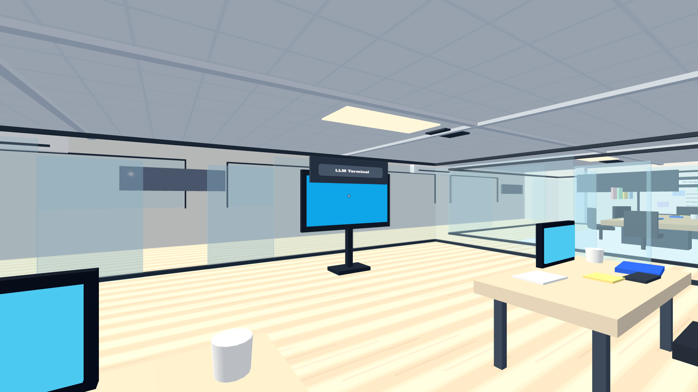
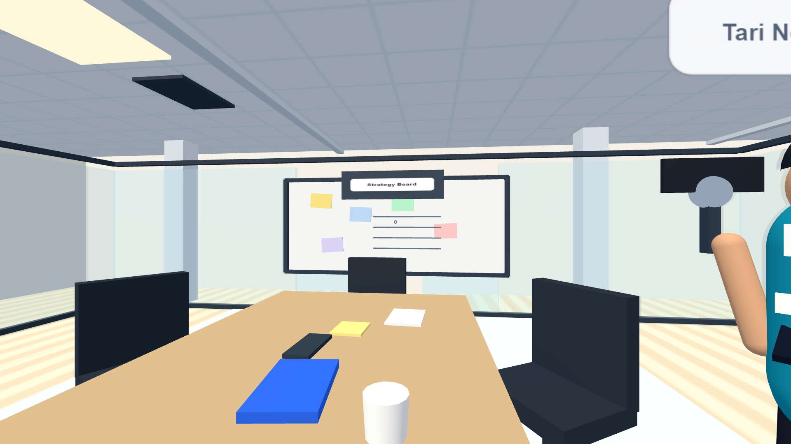
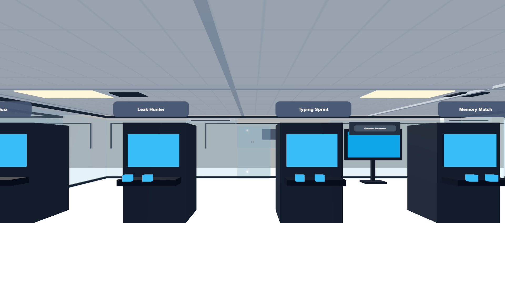
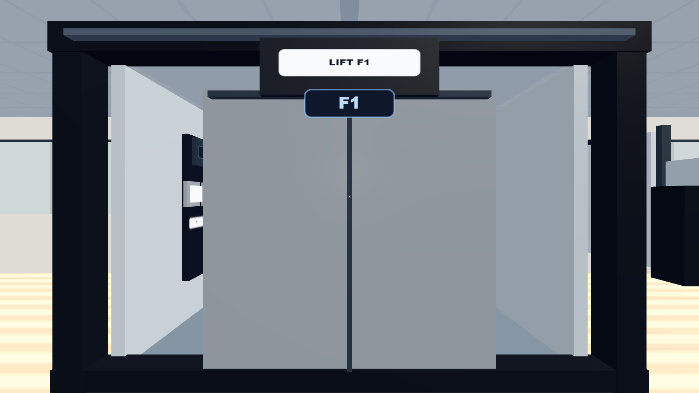

# ModelForge Office

<p align="center">
  
</p>

<p align="center">
  <strong>A first-person AI office for Kaggle strategy, data workflow, notebook execution, and multi-advisor decision making.</strong>
</p>

<p align="center">
  <a href="#quick-start"></a>
  <a href="#current-version"></a>
  <a href="#tech-stack"></a>
  <a href="#backend-and-llm"></a>
  <a href="#safety-model"></a>
</p>

## Why This Exists

Kaggle work is rarely a single prompt. It is a loop of reading the brief, understanding the data, choosing validation, building baselines, reviewing experiments, avoiding leakage, and deciding when a submission is actually worth making.

**ModelForge Office** turns that loop into a virtual workspace: a first-person office where each room represents a part of the Kaggle workflow and AI coworkers help you reason through the competition instead of blindly outsourcing the work.

The project is intentionally ambitious: part 3D workspace, part Kaggle operating system, part local AI assistant lab.

## Current Version

**Current release: `v2.8.0`**

This version focuses on making War Room meetings useful and readable when many advisors participate:

- Rebuilt Debate Stage into a Stage + Transcript layout: advisor cards now show only status, while long answers live in a scrollable transcript pane.
- Added meeting modes for strategy, data/EDA review, validation/leakage audit, experiment review, and submission gate.
- Added LLM Scribe synthesis with structured sections: executive summary, key decisions, most valuable insights, risks, next experiments, open questions, and next meeting recommendation.
- Added save actions for decisions, full transcript, and next experiments so useful meeting output flows back into the board and experiment log.
- Improved rich-text rendering and responsive layout so long LLM answers wrap cleanly on desktop and laptop viewports.

> Status note: the app is usable as a prototype. The War Room meeting workflow is now much stronger, while the 3D office remains under active visual rebuild for prop consistency, pathing, and better asset quality.

## Product Vision

ModelForge Office is designed around a simple idea:

> Do not just ask AI to solve a Kaggle competition. Build an environment that helps you understand the work, challenge assumptions, and keep a decision trail.

The intended user flow:

1. Start a project from a Kaggle competition slug or URL.
2. Download or manually place competition data in the project workspace.
3. Profile the files and expose reliable data facts to advisors.
4. Ask the Mission Router or individual AI coworkers for guidance.
5. Create notebooks or scripts in the competition `code` folder.
6. Run safe-gated notebook/script execution.
7. Save conclusions to the board, experiment log, and meeting summaries.
8. Use the War Room for debate before important modeling or submission decisions.

## Screenshots

| War Room | Floor 3 Games |
| --- | --- |
|  |  |

| Physical Elevator | Office Workspace |
| --- | --- |
|  |  |

## Feature Highlights

### First-Person 3D Office

- Three-floor virtual office built with Three.js.
- First-person movement, pointer lock, room hints, interactable objects, seating, and lift traversal.
- Rooms mapped to the Kaggle workflow: Lobby, Data Lab, Model Lab, War Room, Review Room, Learning Studio, and Recharge/Gaming floor.

### Mission Control

Mission Control is the operations panel for the project:

- Competition intake and Kaggle analysis.
- Advisor/LLM configuration.
- Coding Studio access.
- Meeting setup and Debate Stage.
- Board, whiteboard, and experiment log surfaces.
- Settings for movement, audio, focus mode, and QA overlay.

### AI Coworker Discussion UX

Instead of forcing all conversation into a tiny side panel, the current UX supports:

- Fullscreen coworker conversation overlay.
- RPG-style interaction when approaching NPC coworkers.
- Quick prompts such as project explanation, risks, next experiment, concept teaching, and board capture.
- Mission Router for fast work when you do not want to manually walk to every role.

### Kaggle Workspace Structure

Each competition has a local workspace:

```text
data/competitions/<slug>/
├── raw/       # Kaggle data or manually placed competition files
├── code/      # notebooks and scripts
├── outputs/   # plots, reports, draft submissions, artifacts
└── runs/      # safe-run execution logs
```

This makes it possible to keep using Codex, VS Code, notebooks, or other coding tools while ModelForge Office reads, reviews, and runs files from the same workspace.

### Coding Studio and Safe Runner

The backend exposes a safe-gated workflow for code execution:

- Scan competition workspace files.
- Create notebook/script templates.
- Preview code files.
- Run `.py` and `.ipynb` files only inside the competition `code` directory.
- Save stdout/stderr/status into `runs`.

No free-form terminal is exposed in the browser.

### Backend and LLM

The backend is a FastAPI service with support for:

- Local rule fallback.
- Ollama-backed local LLMs.
- OpenAI-compatible local or remote endpoints.
- Kaggle CLI operations server-side.
- Whisper-style speech-to-text endpoint.

Recommended local baseline for a typical laptop:

- `gemma3:4b` through Ollama as a practical default.
- Smaller or quantized models if memory is limited.
- Larger models should be treated as advanced/remote options.

## Tech Stack

| Layer | Technology |
| --- | --- |
| 3D frontend | Three.js, vanilla JavaScript modules |
| UI | HTML, CSS, browser localStorage |
| Backend | FastAPI, Python |
| LLM integration | Ollama or OpenAI-compatible endpoint |
| Kaggle integration | Kaggle CLI, server-side only |
| Voice transcription | Whisper-compatible backend path |
| Tests | Node test runner, Python compile check |
| Visual QA | Playwright screenshot automation |

## Quick Start

### 1. Install dependencies

```bash
npm install
```

For the backend:

```bash
cd server
python -m venv .venv
.venv\Scripts\activate
pip install -r requirements.txt
```

### 2. Run on Windows

From the project root:

```bash
run_windows.bat
```

Then open:

```text
http://127.0.0.1:8000
```

The launcher starts:

- Frontend: `http://127.0.0.1:8000`
- Backend: `http://127.0.0.1:7860`
- Chat endpoint: `http://127.0.0.1:7860/api/chat`

### 3. Manual frontend-only run

```bash
python -m http.server 8000
```

Then open:

```text
http://127.0.0.1:8000
```

## Backend and LLM

### Ollama example

```bash
cd server
.venv\Scripts\activate
set LLM_PROVIDER=ollama
set OLLAMA_MODEL=gemma3:4b
uvicorn main:app --host 127.0.0.1 --port 7860
```

### OpenAI-compatible endpoint example

```bash
cd server
.venv\Scripts\activate
set LLM_PROVIDER=openai-compatible
set LLM_BASE_URL=http://localhost:1234/v1
set LLM_API_KEY=optional
set LLM_MODEL=your-model-name
uvicorn main:app --host 127.0.0.1 --port 7860
```

If the UI says the backend is using `local-rule`, the backend is reachable but no configured model provider responded successfully.

## Kaggle Data Workflow

Kaggle credentials must stay on the local machine and are never placed in the browser.

Install and configure the Kaggle CLI:

```bash
pip install kaggle
```

Place `kaggle.json` according to Kaggle's CLI instructions, then use Mission Control to analyze or download a competition.

Data path:

```text
data/competitions/<slug>/raw
```

Manual data placement is also supported. For example:

```text
data/competitions/titanic/raw/train.csv
data/competitions/titanic/raw/test.csv
data/competitions/titanic/raw/sample_submission.csv
```

## Safety Model

ModelForge Office intentionally avoids unsafe automation:

- No Kaggle token is sent to the browser.
- Kaggle CLI is called server-side with an allowlisted command path.
- Notebook/script execution is restricted to files inside `data/competitions/<slug>/code`.
- No automatic Kaggle submission is performed.
- Local datasets and generated run artifacts are ignored by Git by default.

## Quality Checks

```bash
node --check js/world.js js/app.js js/config.js js/audio.js js/advisors.js tools/visual_qa.mjs
npm test
.\server\.venv\Scripts\python.exe -m py_compile server\main.py
npm run qa:visual
```

Visual QA screenshots are generated in `qa-artifacts/` and are intentionally ignored by Git. Selected public screenshots live in `docs/images/`.

## Repository Structure

```text
.
├── assets/              # optional local model/assets manifest
├── css/                 # application styles
├── data/                # local Kaggle workspace root; datasets ignored by Git
├── docs/                # documentation and README images
├── js/                  # frontend application, advisor state, and 3D world
├── scripts/             # helper scripts
├── server/              # FastAPI backend
├── tools/               # visual QA automation
├── index.html
├── package.json
├── run_windows.bat
└── README.md
```

## Roadmap

### Near-term: Environment Rebuild Pass

- Rebuild the elevator with better proportions and less visual clutter.
- Replace rough low-poly props with a consistent modern-office prop catalog.
- Audit every room for floating props, blocked entrances, bad signage, and backwards monitors.
- Improve collision so small decorative props never trap the player.
- Use visual QA presets as a required gate before claiming a visual change is complete.

### Product Workflow

- Improve Mission Router advisor selection by room and task context.
- Strengthen notebook review summaries using real workspace files and run logs.
- Make the Project Progress Wall show data readiness, baseline status, best score, latest run, and next action.
- Add a guided first-run office tour for new users.

### AI and Voice

- Improve local LLM setup diagnostics.
- Add better model/provider status in Mission Control.
- Explore higher-quality local or OpenAI-compatible TTS as an optional voice layer.

## License

This repository is currently published as an experimental prototype. Add a formal license before using it in production or accepting external contributions.
